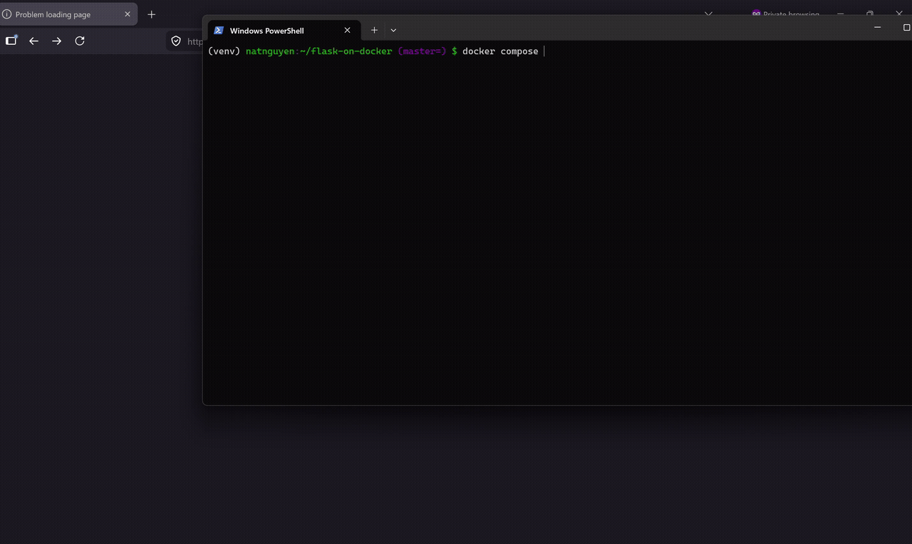

# Flask on Docker

[](https://github.com/natnguyen215/flask-on-docker/actions/workflows/python-app.yml)

A Flask application containerized with Docker using PostgreSQL, Gunicorn, and Nginx. The application supports static files and image uploads.

## Demo



## Environment setup

Create the following sample environment files in the root of the repository before starting the application.

### `.env.dev`

```text
FLASK_APP=project/__init__.py
FLASK_DEBUG=1
DATABASE_URL=postgresql://hello_flask:hello_flask@db:5432/hello_flask_dev
SQL_HOST=db
SQL_PORT=5432
DATABASE=postgres
APP_FOLDER=/usr/src/app
```

### `.env.prod`

```text
FLASK_APP=project/__init__.py
FLASK_DEBUG=0
DATABASE_URL=postgresql://hello_flask:hello_flask@db:5432/hello_flask_prod
SQL_HOST=db
SQL_PORT=5432
DATABASE=postgres
APP_FOLDER=/home/app/web
```

### `.env.prod.db`

```text
POSTGRES_USER=hello_flask
POSTGRES_PASSWORD=hello_flask
POSTGRES_DB=hello_flask_prod
```

These files are excluded from version control.

## Running the application

### 1. Clone the repository

```bash
git clone https://github.com/natnguyen215/flask-on-docker.git
cd flask-on-docker
```

### 2. Build and start the production services

```bash
docker compose -f docker-compose.prod.yml up -d --build
```

### 3. Create the database

```bash
docker compose -f docker-compose.prod.yml exec web python manage.py create_db
```

### 4. Open the application

On the server, the application is available at:

```text
http://localhost:1143
```

The upload page is available at:

```text
http://localhost:1143/upload
```

If using a server, portforwarding will need to be done.

From the web interface:

1. Select an image from your computer.
2. Submit the upload form.
3. Visit `/media/<filename>` to view the uploaded file.

### 5. Check static files

The example static file is available at:

```text
http://localhost:1143/static/hello.txt
```

### 6. Stop the application

```bash
docker compose -f docker-compose.prod.yml down -v
```

## Development

To build and run the development version:

```bash
docker compose up -d --build
```

Create the development database with:

```bash
docker compose exec web python manage.py create_db
```

Stop the development containers with:

```bash
docker compose down -v
```

The GitHub Actions workflow automatically verifies that the development Docker configuration builds successfully.
